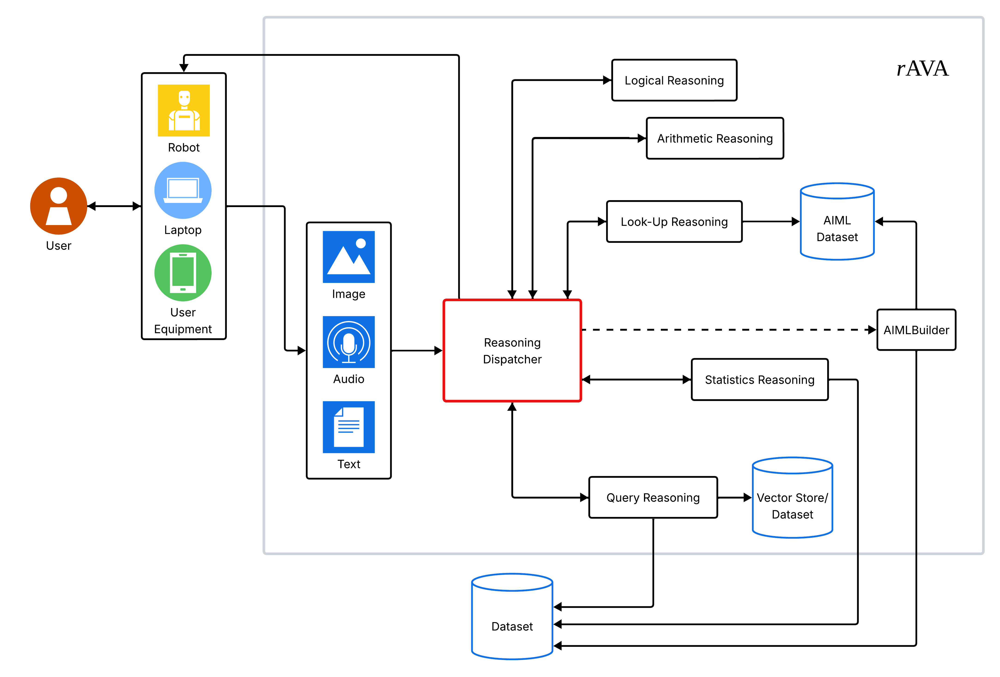

# rAVA — Arquitetura Neuro-Simbólica Multimodal

Aerty Santos  

| AVAILABLE DOWNLOADS |
| :------------------: |
| [APRESENTAÇÃO](#apresentação) |
| [VIDEOS](#vídeos) |

---

## Index
- [Descrição](#descrição)
- [rAVA](#rava)
- [Arquitetura Neuro-Simbólica Multimodal](#arquitetura-neuro-simbólica-multimodal)
- [Requisitos do Sistema](#requisitos-do-sistema)
- [Instruções para Replicar](#instruções-para-replicar)
- [Crie um ambiente com o Miniconda e ative-o](#crie-um-ambiente-com-o-miniconda-e-ative-o)
- [Testes Iniciais](#testes-iniciais)
- [Resultados e Discussão](#resultados-e-discussão)
- [Casos de Uso](#casos-de-uso)
- [Conclusão](#conclusão)
- [Vídeos](#vídeos)
- [Referências](#referências)

---

## Descrição
O **rAVA ** evolui para uma **arquitetura neuro-simbólica multimodal**, integrando **aprendizado neural** e **razão simbólica** em um sistema cognitivo unificado.  
O projeto tem como objetivo ampliar as capacidades de leitura e compreensão cognitiva do rAVA original — inicialmente textual — para um modelo capaz de **interpretar voz, imagem e texto** de forma integrada e explicável.  

A proposta posiciona o rAVA como um **cérebro multimodal**, capaz de **raciocinar simbolicamente, aprender com dados e justificar suas inferências**, promovendo transparência e interpretabilidade em tarefas complexas como análise de decisões judiciais e processos educacionais.

---

## rAVA
O rAVA foi concebido a partir da necessidade de desenvolver um **sistema cognitivo interpretável, modular e adaptável**, que pudesse combinar inferência simbólica e aprendizado profundo de modo coeso.  



---

## Arquitetura Neuro-Simbólica Multimodal

O **rAVA** é estruturado em **quatro módulos cognitivos principais**, interligados por um núcleo de controle responsável pela coerência e integração do raciocínio global do sistema.

- **Arithmetic Reasoning:**  
  Responsável pela **manipulação e inferência quantitativa**, permitindo que o sistema realize **operações matemáticas, estimativas e deduções numéricas**.  
  Esse módulo utiliza representações vetoriais e simbólicas para lidar com tarefas que envolvem medidas, contagens e proporções, sendo essencial para cenários de raciocínio lógico ou análise de dados estruturados.

- **Statistic Reasoning:**  
  Executa **inferências probabilísticas e correlações estatísticas**, integrando o aprendizado neural com abordagens bayesianas e modelagem de incerteza.  
  É responsável por interpretar dados amostrais, calcular **tendências e confiabilidade**, e apoiar o sistema em tarefas que exigem **análise quantitativa e inferência preditiva**.

- **Query Reasoning:**  
  Atua na **interpretação e execução de consultas em linguagem natural**, transformando perguntas textuais em **operações simbólicas e semânticas** sobre bancos de conhecimento estruturados (como XML, ontologias e bases vetoriais).  
  É o principal componente de **raciocínio semântico** do rAVA, capaz de decompor perguntas complexas e coordenar respostas explicáveis.

- **Look-up Module:**  
  Realiza **recuperação direta de conhecimento** a partir de fontes internas (ontologias, vetores de embeddings, documentos RAG) e externas (APIs, bancos de dados, repositórios XML).  
  Esse módulo garante **eficiência e precisão** na busca de informações, permitindo ao rAVA fundamentar suas respostas em evidências e contextos reais.

Esses módulos trabalham de forma **complementar e coordenada**, compondo um ecossistema cognitivo que combina **raciocínio lógico, inferência estatística e recuperação contextual de conhecimento**.  
O ambiente foi configurado com **Miniconda**, garantindo **isolamento, portabilidade e reprodutibilidade** de todos os experimentos.

---

## Requisitos do Sistema
- **Sistema operacional:** Ubuntu 22.04 LTS ou superior  
- **Python:** 3.10 ou posterior  
- **Gerenciador de ambiente:** Miniconda  
- **Bibliotecas principais:**  
  - `transformers`  
  - `langchain`  
  - `sentence-transformers`  
  - `faiss-cpu`  
  - `torch`  
  - `peft`  
  - `openai`  
  - `fastapi`  
  - `xmltodict`  
  - `lxml`  

- **Hardware recomendado:**  
  - CPU com suporte a AVX  
  - GPU NVIDIA A100 (para aceleração de modelos neurais)  
  - Memória RAM mínima: 16 GB  

---

## Instruções para Replicar

1. **Clone este repositório:**
   ```bash
   git clone https://github.com/AertySantos/rAVA.git
   cd arquitetura_rava
   ```

2. **Crie um ambiente com o Miniconda e ative-o:**
   ```bash
   conda create -n rava python=3.10 -y
   conda activate rava
   ```

3. **Instale as dependências:**
   ```bash
   pip install -r requirements.txt
   ```

4. **Execute o módulo principal:**
   ```bash
   python3 main.py
   ```
---

## Crie um ambiente com o Miniconda e ative-o

Para garantir a reprodutibilidade e o isolamento do ambiente do **rAVA**, recomenda-se o uso do **Miniconda** como gerenciador de pacotes e ambientes virtuais.

### 1. Verifique se o Miniconda está instalado
```bash
conda --version
```

Se o comando não retornar uma versão, instale o Miniconda a partir do site oficial:  
🔗 [https://docs.conda.io/en/latest/miniconda.html](https://docs.conda.io/en/latest/miniconda.html)

---

### 2. Crie um novo ambiente para o rAVA
```bash
conda create -n rava python=3.10 -y
```

---

### 3. Ative o ambiente
```bash
conda activate rava
```

---

### 4. Instale as dependências do projeto
```bash
pip install -r requirements.txt
```

---

### 5. Verifique a instalação
```bash
python3 -m pip list
```

---

### 6. Desative o ambiente (opcional)
```bash
conda deactivate
```

---

## Testes Iniciais

Foram realizados testes com entradas em **voz (T1)**, **imagem (T2)** e **texto (T3)**.  
Os resultados médios obtidos estão resumidos abaixo:

| Tipo de Entrada | Tempo Médio (s) | Taxa de Precisão (%) | Falhas (%) |
| :--------------: | :--------------: | :------------------: | :---------: |
| Voz (T1)         | 79.54            | 55.56                | 14.29       |
| Imagem (T2)      | 78.57            | 84.38                | 12.50       |
| Texto (T3)       | 11.11            | 90.88                | 7.14        |

Esses resultados demonstram que o **módulo textual** apresenta maior precisão, enquanto os módulos de voz e imagem oferecem grande potencial de expansão em contextos multimodais.

---

## Resultados e Discussão

Os experimentos mostraram que o rAVA:
- Executa consultas complexas em **linguagem natural**;  
- Realiza **inferência simbólica e estatística** sobre descritores estruturados;  
- Integra múltiplas modalidades perceptivas (voz, imagem e texto);  
- Oferece **explicabilidade** com rastreabilidade semântica e numérica.  

O sistema representa um avanço em **inteligência cognitiva híbrida**, capaz de unir o raciocínio simbólico, o aprendizado neural e a inferência estatística sob uma mesma arquitetura.

---

## Casos de Uso

### 1. Análise de Decisões Judiciais e Transparência
No domínio jurídico, o rAVA é aplicado à **extração e interpretação de metadados de decisões judiciais**, combinando leitura neural de sentenças com **raciocínio simbólico e estatístico**.  
A arquitetura permite **explicações interpretáveis** e identificação de **padrões, vieses e recorrências linguísticas**, auxiliando pesquisadores e magistrados na tomada de decisões fundamentadas.

---

## Conclusão
O rAVA consolida-se como uma **arquitetura neuro-simbólica multimodal**, que combina **razão simbólica, inferência estatística e recuperação contextual** sob um mesmo núcleo cognitivo.  
Sua estrutura modular e transparente o posiciona como um exemplo de **IA explicável e responsável**, capaz de operar de forma multimodal e autoexplicativa em diferentes domínios.  

A convergência entre **Arithmetic Reasoning, Statistic Reasoning, Query Reasoning e Look-up** reafirma o rAVA como uma proposta sólida de **inteligência artificial cognitiva híbrida**, unindo percepção, lógica e explicação.

---

## Vídeos
- [Demonstração do rAVA Multimodal](https://youtu.be/XXXXXXXX)


---

## Referências
 
- [LangChain Documentation](https://python.langchain.com)  
- [Transformers Library — Hugging Face](https://huggingface.co/docs/transformers/index)  
- [Retrieval-Augmented Generation (RAG)](https://arxiv.org/pdf/2005.11401.pdf)  
- [Neuro-Symbolic AI: The Third Wave](https://arxiv.org/pdf/2103.13033.pdf)  
```

